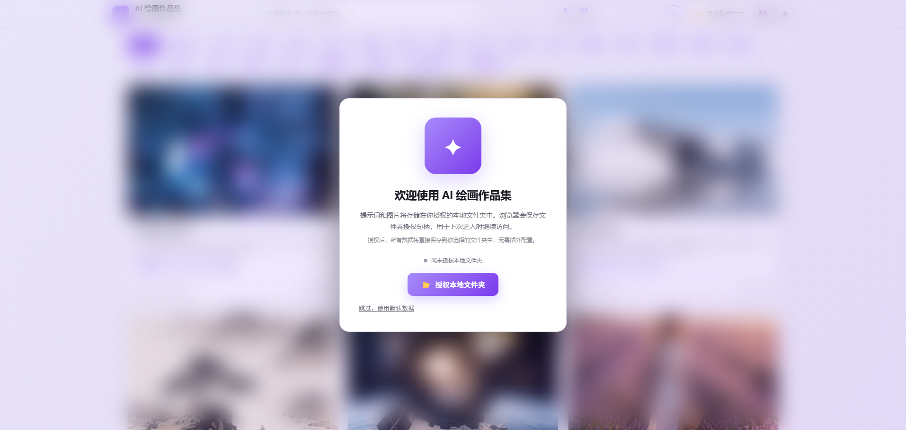
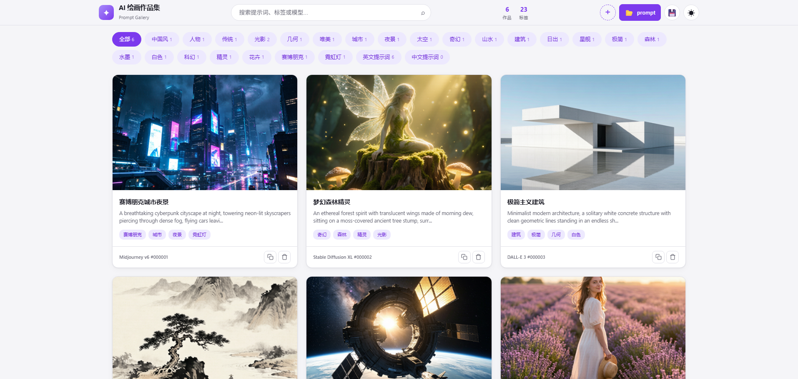
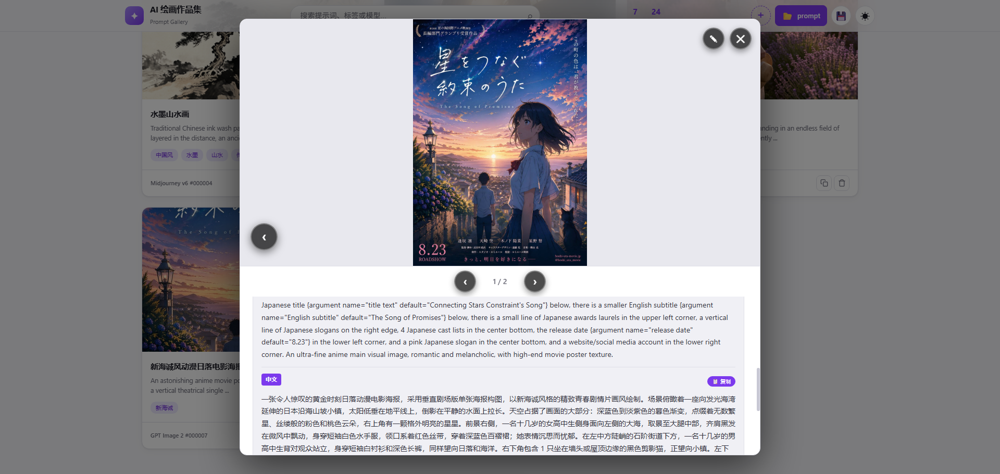

<div align="center">

# AI 绘画作品集 (Prompt Gallery)

[English](./README_EN.md) | **简体中文** | [繁體中文](./README_TW.md)

[](LICENSE)
[](https://www.electronjs.org/)
[]()
[]()

一个用于展示 AI 绘画作品及其提示词的静态画廊页面。支持作品管理、搜索筛选、提示词复制等功能，双击 HTML 文件即可使用。

</div>

## ✨ 特点

- **零依赖**：纯 HTML/CSS/JavaScript，无需安装任何框架或依赖
- **多版本支持**：提供 JSON 版本（推荐）和单 HTML 版本
- **本地存储**：支持授权本地文件夹存储数据，数据完全在你本地（Chrome/Edge）
- **自动保存**：编辑后自动保存到 data.json，无需手动操作
- **数据分离**：默认数据与用户数据分离管理，保护原始数据完整性
- **多图支持**：每个作品可包含多张图片，支持图片切换导航
- **响应式设计**：适配桌面端和移动端
- **深色/浅色主题**：支持主题切换，自动保存偏好
- **快捷操作**：键盘快捷键、一键复制提示词

## 📸 功能展示








## 🚀 快速开始

### 方式一：使用启动脚本（推荐）

```bash
# Windows
双击 scripts/start.bat

# macOS / Linux
chmod +x scripts/start.sh
./scripts/start.sh

# 然后浏览器打开 http://localhost:8080/gallery-json.html
```

### 方式二：手动启动

```bash
# 在项目目录下
python -m http.server 8080

# 或者使用 Node.js
npx http-server -p 8080

# 然后访问 http://localhost:8080/gallery-json.html
```

### 方式三：直接打开（无需服务器）

双击 `gallery-standalone.html` 文件即可在浏览器中打开（部分功能受限）

## 📁 目录结构

```
xxl-ai-gallery/
├── gallery-json.html      # 推荐版本（使用 data.json，需 HTTP 服务器）
├── gallery-standalone.html # 单 HTML 版本（双击即可使用）
├── data_default.json       # 默认示例数据（只读，用于初始化）
├── data_default.js         # 默认示例数据（JS 格式，单 HTML 版本使用）
├── data.json               # 作品数据（JSON 格式，授权后自动创建）
├── main.js                 # Electron 主进程文件，包含窗口管理、菜单创建和文件操作功能
├── package.json            # 项目配置文件，包含依赖、构建脚本和打包配置
├── images/                 # 存放 AI 生成的图片
├── docs/                   # 文档目录
│   ├── BUILD.md            # 打包指南
│   ├── INSTALL.md          # 安装指南
│   ├── DEPLOY.md           # 云服务器部署指南
│   ├── TECH_RESEARCH.md    # 技术调研文档
│   └── images/             # 文档图片
└── scripts/                # 脚本目录
    ├── build.bat           # Windows 打包脚本
    ├── test.bat            # Windows 测试脚本
    └── start.bat           # Windows 启动脚本
```

## 📖 使用说明

### 本地文件夹授权

首次打开页面时，会显示授权对话框：

1. **授权本地文件夹**：点击按钮选择一个文件夹，所有数据将存储在该文件夹中
2. **跳过授权**：点击"暂时跳过"，数据将仅存储在浏览器 localStorage 中
3. **后续访问**：浏览器会保存授权状态，下次打开时无需重新授权

**授权的好处**：
- 数据直接存储在你选择的文件夹中，可随时备份或迁移
- 图片文件也保存在同一文件夹中，便于管理
- 数据不会因浏览器缓存清理而丢失

**注意**：需要使用 Chrome 或 Edge 浏览器，其他浏览器不支持此功能。

### 数据管理

项目采用**双文件数据管理**架构：

- **`data_default.json`**：默认示例数据（只读），包含初始的示例作品
- **`data.json`**：用户实际使用的数据文件（授权后自动创建）

**首次使用流程**：
1. 页面打开时检查是否已授权本地文件夹
2. 首次访问时会提示授权本地文件夹，授权后自动创建 `data.json`
3. 用户后续添加、编辑、删除的数据都会保存到 `data.json`

**数据分离的好处**：
- `data_default.json` 作为默认数据源，不会被修改
- 用户可以随时重置到初始状态（删除 `data.json` 或清除浏览器 localStorage）
- 便于版本管理和数据备份

### 浏览作品

- 打开页面后，所有作品以卡片网格形式展示
- 点击标签可筛选特定类型的作品
- 使用顶部搜索框搜索标题、提示词、模型或标签
- 支持按提示词语言筛选（中文/英文）

### 查看详情

- 点击作品卡片查看大图和完整提示词
- 多图作品可使用左右箭头切换图片
- 点击"复制"按钮一键复制提示词

### 添加新作品

**方式一：页面表单添加（推荐）**

1. 点击右上角 `+` 按钮
2. 填写作品信息（标题、提示词、标签等）
3. 选择图片文件（支持多选）
4. 点击"保存"

如果已授权本地文件夹，修改会自动保存到 `data.json`。

**方式二：手动编辑 data.json**

1. 将图片放入 `images/` 目录
2. 在 `data.json` 中添加记录：

```javascript
{
    "id": 7,
    "images": ["images/你的图片.png"],
    "promptEn": "英文提示词",
    "promptZh": "中文提示词",
    "title": "作品标题",
    "tags": ["标签1", "标签2"],
    "model": "Midjourney v6",
    "createdAt": "2026-03-01",
    "updatedAt": "2026-03-01"
}
```

### 编辑/删除作品

- 点击作品卡片进入详情
- 点击右上角编辑按钮（✎）进入编辑模式
- 修改信息后点击"保存"
- 点击"删除"可删除作品

### 导出数据

点击顶部 💾 按钮可导出当前所有数据为 `data.json` 文件

## ⌨️ 快捷键

| 快捷键 | 功能 |
|--------|------|
| `←` / `→` | 切换上/下一个作品 |
| `Esc` | 关闭弹窗 |
| `Ctrl+C` | 复制当前提示词 |
| `Ctrl+Enter` | 保存表单 |

## 🎨 数据结构

每个作品的数据结构如下：

```javascript
{
    "id": 1,                      // 唯一标识符
    "images": ["images/1.png"],   // 图片路径数组（支持多图）
    "promptEn": "英文提示词",      // 英文提示词
    "promptZh": "中文提示词",      // 中文提示词
    "title": "作品标题",           // 作品标题
    "tags": ["标签1", "标签2"],    // 标签数组
    "model": "Midjourney v6",     // AI 模型名称
    "createdAt": "2026-03-01",        // 创建时间
    "updatedAt": "2026-03-01"          // 更新时间
}
```

## 🌐 浏览器兼容性

| 功能 | Chrome | Edge | Firefox | Safari |
|------|--------|------|---------|--------|
| 基础展示 | ✅ | ✅ | ✅ | ✅ |
| File System Access API | ✅ | ✅ | ❌ | ❌ |
| 手动导出 | ✅ | ✅ | ✅ | ✅ |

> **提示**：Chrome/Edge 用户可享受自动保存功能，其他浏览器请使用手动导出。

## 🌐 云服务器部署注意事项

### 重要：File System Access API 安全上下文要求

`window.showDirectoryPicker` (File System Access API) 在 Chrome/Edge 中**必须在安全上下文下才能使用**：

| 访问方式 | localhost | HTTP 远程 | HTTPS 远程 |
|---------|-----------|-----------|------------|
| Chrome  | ✅ | ❌ | ✅ |
| Edge    | ✅ | ❌ | ✅ |
| Safari  | ❌ | ❌ | ❌ |

**错误提示**：如果你通过 `http://服务器IP:端口` 访问，会提示"浏览器不支持文件夹选择功能"，但实际原因是**协议不安全**。

### 解决方案

#### 方案一：配置 HTTPS（推荐）
- 配置 SSL 证书，使用 HTTPS 访问
- File System Access API 完整可用
- 需要域名或使用免费证书服务

#### 方案二：使用 Cloudflare Tunnel（无需域名）
```bash
# 安装 cloudflared
brew install cloudflare/cloudflare/cloudflared

# 创建免费隧道（自动分配 trycloudflare.com 子域名）
cloudflared tunnel --url http://localhost:8081
```
会生成一个 `https://xxx.trycloudflare.com` 的免费 HTTPS 链接。

#### 方案三：打包成桌面应用（最佳方案）
- 不需要域名、不需要 HTTPS
- 完整文件系统访问权限
- 双击即可运行，无需启动 HTTP 服务器

```bash
# 在项目目录下
npm install
npm run build:mac    # macOS
npm run build:win    # Windows
npm run build:linux  # Linux
```

### Nginx 配置示例

如果你已有 SSL 证书，Nginx 配置参考：

```nginx
server {
    listen 443 ssl;
    server_name your-domain.com;
    
    ssl_certificate /path/to/cert.pem;
    ssl_certificate_key /path/to/key.pem;
    
    root /www/sites/xxl-ai-gallery/index;
    
    # 其他配置...
}
```

### 详细部署指南

更多部署细节，请参考 [云服务器部署指南](./docs/DEPLOY.md)。

## 🖥️ 桌面应用打包

本项目支持打包成独立的桌面应用程序（Windows、macOS、Linux），无需浏览器即可运行。

### 快速打包（Windows）

1. 双击运行 `scripts/build.bat`
2. 等待打包完成
3. 在 `dist` 目录中找到安装程序 `AI Gallery Setup.exe`

### 故障排除

如果打包后没有生成 `dist` 目录，请尝试以下步骤：

1. **检查依赖**：确保 `node_modules` 目录存在且包含 `electron` 和 `electron-builder`
2. **清除缓存**：运行 `npm cache clean --force` 后重新安装依赖
5. **检查网络**：确保网络连接正常，能访问 npm 镜像源
6. **检查目录**：确保脚本在项目根目录运行（脚本会自动切换目录）

### 测试应用（Windows）

在打包之前，建议先测试应用是否能正常运行：

1. 双击运行 `scripts/test.bat`
2. 等待依赖安装完成
3. 应用将自动启动
4. 测试所有功能是否正常
5. 关闭应用窗口

### 手动打包（所有平台）

```bash
# 安装依赖
npm install

# 打包当前平台版本
npm run build

# 或者指定平台打包
npm run build:win      # Windows
npm run build:win -- -c.win.signAndEditExecutable=false
npm run build:mac      # macOS
npm run build:linux    # Linux
```

### 打包后特性

- **双击即可运行**：不需要启动 HTTP 服务器
- **完整的文件系统访问**：可以直接读写本地文件
- **原生应用体验**：原生菜单、快捷键、系统托盘
- **可分发**：打包后的应用可以分享给其他人使用

### 详细说明

更多打包选项和故障排除，请参考 [打包指南](./docs/BUILD.md)。

## 📝 相关文档

- [技术调研文档](./docs/TECH_RESEARCH.md) - 数据持久化方案对比、技术细节与打包方案分析
- [安装指南](./docs/INSTALL.md) - 详细安装和运行说明
- [云服务器部署指南](./docs/DEPLOY.md) - 云服务器部署、HTTPS 配置和 File System Access API 问题解决

## 许可证

MIT License
