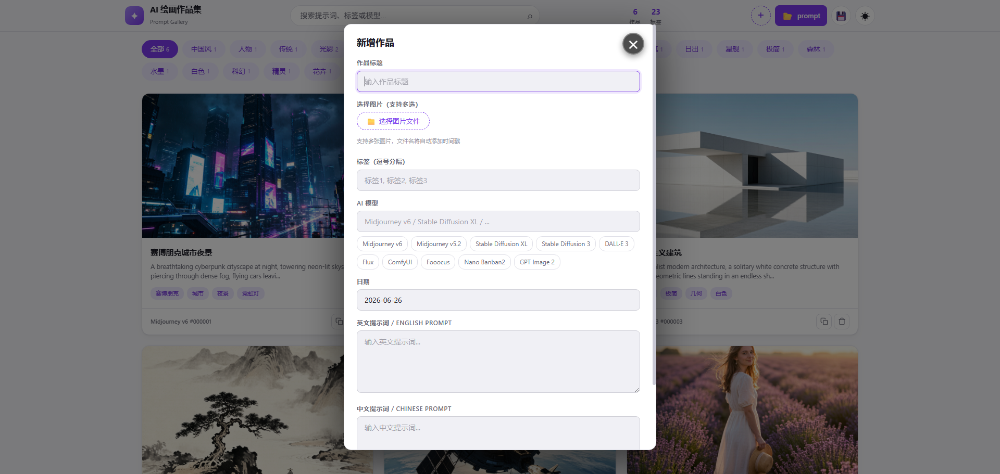

<div align="center">

# AI 繪畫作品集 (Prompt Gallery)

[English](./README_EN.md) | [简体中文](./README.md) | **繁體中文**

[](LICENSE)
[](https://www.electronjs.org/)
[]()
[]()

一個用於展示 AI 繪畫作品及其提示詞的靜態畫廊頁面。支援作品管理、搜尋篩選、提示詞複製等功能，雙擊 HTML 檔案即可使用。

</div>

## ✨ 特點

- **零依賴**：純 HTML/CSS/JavaScript，無需安裝任何框架或依賴
- **多版本支援**：提供 JSON 版本（推薦）和單 HTML 版本
- **本機儲存**：支援授權本機資料夾儲存資料，資料完全在你本機（Chrome/Edge）
- **自動儲存**：編輯後自動儲存到 data.json，無需手動操作
- **資料分離**：預設資料與使用者資料分離管理，保護原始資料完整性
- **多圖支援**：每個作品可包含多張圖片，支援圖片切換導航
- **響應式設計**：適配桌面端和行動端
- **深色/淺色主題**：支援主題切換，自動儲存偏好
- **快捷操作**：鍵盤快捷鍵、一鍵複製提示詞

## 📸 功能展示





## 🚀 快速開始

### 方式一：使用啟動腳本（推薦）

```bash
# Windows
雙擊 scripts/start.bat

# macOS / Linux
chmod +x scripts/start.sh
./scripts/start.sh

# 然後瀏覽器開啟 http://localhost:8080/gallery-json.html
```

### 方式二：手動啟動

```bash
# 在專案目錄下
python -m http.server 8080

# 或者使用 Node.js
npx http-server -p 8080

# 然後訪問 http://localhost:8080/gallery-json.html
```

### 方式三：直接開啟（無需伺服器）

雙擊 `gallery-standalone.html` 檔案即可在瀏覽器中開啟（部分功能受限）

## 📁 目錄結構

```
xxl-ai-gallery/
├── gallery-json.html        # 推薦版本（使用 data.json，需 HTTP 伺服器）
├── gallery-standalone.html  # 單 HTML 版本（雙擊即可使用）
├── data_default.json        # 預設範例資料（唯讀，用於初始化）
├── data_default.js          # 預設範例資料（JS 格式，單 HTML 版本使用）
├── data.json                # 作品資料（JSON 格式，授權後自動建立）
├── main.js                  # Electron 主程式檔案
├── package.json             # 專案設定檔
├── images/                  # 存放 AI 生成的圖片
├── docs/                    # 文件目錄
└── scripts/                 # 腳本目錄
```

## 📖 使用說明

### 本機資料夾授權

首次開啟頁面時，會顯示授權對話框：

1. **授權本機資料夾**：點擊按鈕選擇一個資料夾，所有資料將儲存在該資料夾中
2. **跳過授權**：點擊「暫時跳過」，資料將僅儲存在瀏覽器 localStorage 中
3. **後續存取**：瀏覽器會儲存授權狀態，下次開啟時無需重新授權

**授權的好處**：
- 資料直接儲存在你選擇的資料夾中，可隨時備份或遷移
- 圖片檔案也儲存在同一資料夾中，便於管理
- 資料不會因瀏覽器快取清理而遺失

**注意**：需要使用 Chrome 或 Edge 瀏覽器，其他瀏覽器不支援此功能。

### 資料管理

專案採用**雙檔案資料管理**架構：

- **`data_default.json`**：預設範例資料（唯讀），包含初始的範例作品
- **`data.json`**：使用者實際使用的資料檔案（授權後自動建立）

### 瀏覽作品

- 開啟頁面後，所有作品以卡片網格形式展示
- 點擊標籤可篩選特定類型的作品
- 使用頂部搜尋框搜尋標題、提示詞、模型或標籤
- 支援按提示詞語言篩選（中文/英文）

### 新增作品

**方式一：頁面表單新增（推薦）**

1. 點擊右上角 `+` 按鈕
2. 填寫作品資訊（標題、提示詞、標籤等）
3. 選擇圖片檔案（支援多選）
4. 點擊「儲存」

**方式二：手動編輯 data.json**

```javascript
{
    "id": 7,
    "images": ["images/你的圖片.png"],
    "promptEn": "英文提示詞",
    "promptZh": "中文提示詞",
    "title": "作品標題",
    "tags": ["標籤1", "標籤2"],
    "model": "Midjourney v6",
    "date": "2026-03-01"
}
```

## ⌨️ 快捷鍵

| 快捷鍵 | 功能 |
|--------|------|
| `←` / `→` | 切換上/下一個作品 |
| `Esc` | 關閉彈窗 |
| `Ctrl+C` | 複製當前提示詞 |
| `Ctrl+Enter` | 儲存表單 |

## 🌐 瀏覽器相容性

| 功能 | Chrome | Edge | Firefox | Safari |
|------|--------|------|---------|--------|
| 基礎展示 | ✅ | ✅ | ✅ | ✅ |
| File System Access API | ✅ | ✅ | ❌ | ❌ |
| 手動匯出 | ✅ | ✅ | ✅ | ✅ |

> **提示**：Chrome/Edge 使用者可享受自動儲存功能，其他瀏覽器請使用手動匯出。

## 🌐 雲端伺服器部署注意事項

### 重要：File System Access API 安全上下文要求

`window.showDirectoryPicker` (File System Access API) 在 Chrome/Edge 中**必須在安全上下文下才能使用**：

| 存取方式 | localhost | HTTP 遠端 | HTTPS 遠端 |
|---------|-----------|-----------|------------|
| Chrome  | ✅ | ❌ | ✅ |
| Edge    | ✅ | ❌ | ✅ |
| Safari  | ❌ | ❌ | ❌ |

### 解決方案

#### 方案一：設定 HTTPS（推薦）
- 設定 SSL 憑證，使用 HTTPS 存取
- File System Access API 完整可用

#### 方案二：使用 Cloudflare Tunnel（無需網域）
```bash
brew install cloudflare/cloudflare/cloudflared
cloudflared tunnel --url http://localhost:8081
```

#### 方案三：打包成桌面應用（最佳方案）
```bash
npm install
npm run build:mac    # macOS
npm run build:win    # Windows
npm run build:linux  # Linux
```

更多部署細節，請參考 [雲端伺服器部署指南](./docs/DEPLOY.md)。

## 🖥️ 桌面應用打包

### 快速打包（Windows）

1. 雙擊執行 `scripts/build.bat`
2. 等待打包完成
3. 在 `dist` 目錄中找到安裝程式 `AI Gallery Setup.exe`

### 手動打包（所有平台）

```bash
npm install
npm run build        # 當前平台
npm run build:win    # Windows
npm run build:mac    # macOS
npm run build:linux  # Linux
```

### 打包後特性

- **雙擊即可執行**：不需要啟動 HTTP 伺服器
- **完整的檔案系統存取**：可以直接讀寫本機檔案
- **原生應用體驗**：原生選單、快捷鍵、系統匣
- **可分發**：打包後的應用可以分享給其他人使用

更多打包選項，請參考 [打包指南](./docs/BUILD.md)。

## 📝 相關文件

- [技術調研文件](./docs/TECH_RESEARCH.md) - 資料持久化方案對比與技術細節
- [安裝指南](./docs/INSTALL.md) - 詳細安裝和執行說明
- [雲端伺服器部署指南](./docs/DEPLOY.md) - 雲端伺服器部署和 HTTPS 設定

## 許可證

MIT License
